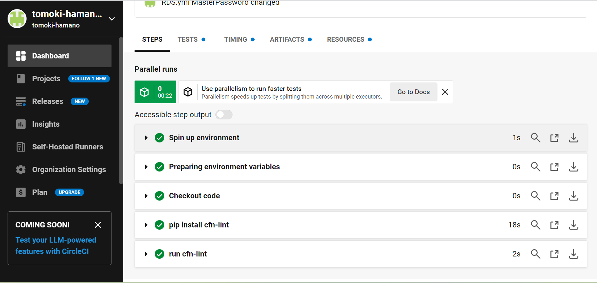

# 第12回課題

## 課題内容:CircleCiを使ってみよう
- 事前配布されたサンプルコードを使用
```
version: 2.1
orbs:
  python: circleci/python@2.0.3
jobs:
  cfn-lint:
    executor: python/default
    steps:
      - checkout
      - run: pip install cfn-lint
      - run:
          name: run cfn-lint
          command: |
            cfn-lint -i W3002 -t cloudformation/*.yml

workflows:
  raisetech:
    jobs:
      - cfn-lint
```
- リポジトリに組み込み、サンプルコードが正しく動作することを確認
