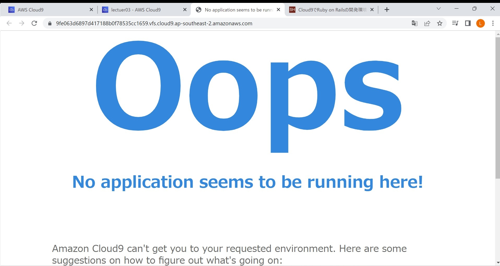
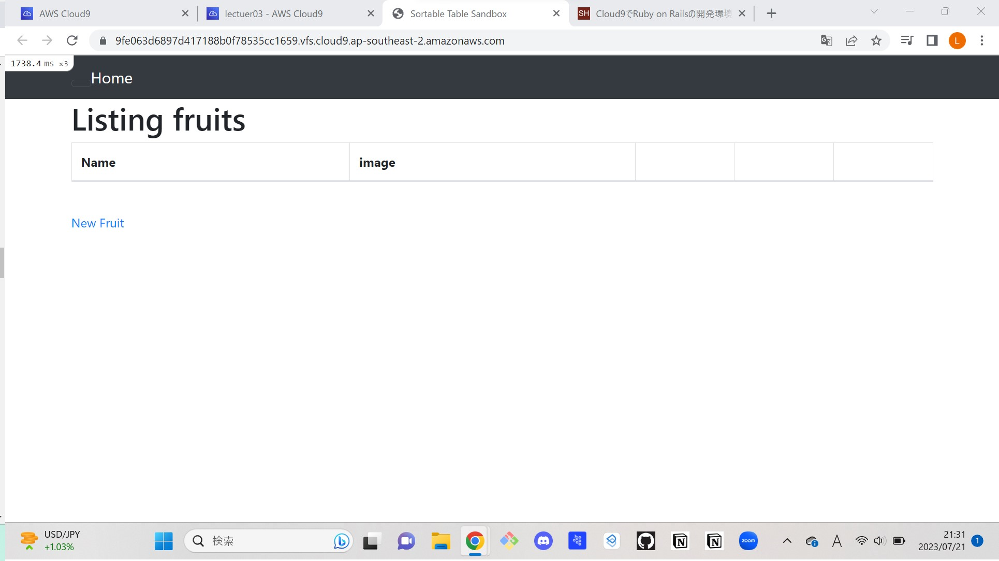

# 第３回課題
- APサーバ名・バージョン:puma　・ver7.0.4
- APサーバーを終了させた場合、引き続きアクセスできるか:できない
- 
- APサーバーを起動させた場合
- 
- DBサーバー名・バージョン:mysql　・ver8.0.34
- DBサーバーを終了させた場合、引き続きアクセスできるか:できない
- 
- Railsの構成管理ツールの名前:bundler

## レポート
- アプリはAPサーバー、データベースはDBサーバーとそれぞれ分業されていること、どちらかが欠けてもアクセスは失敗することがわかりました。APサーバーがブラウザとの連携によるWEB処理までしてくれるのは助かると感じました。
