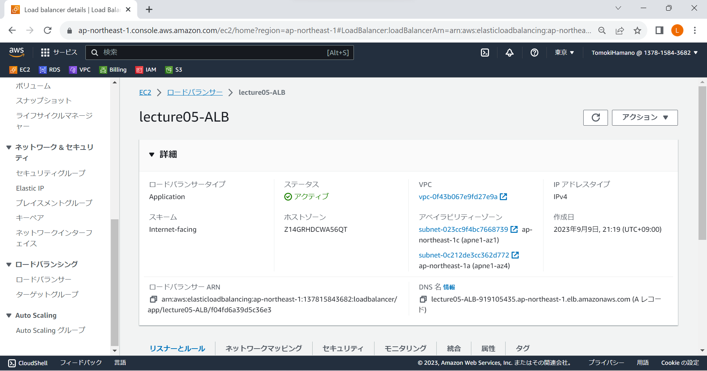
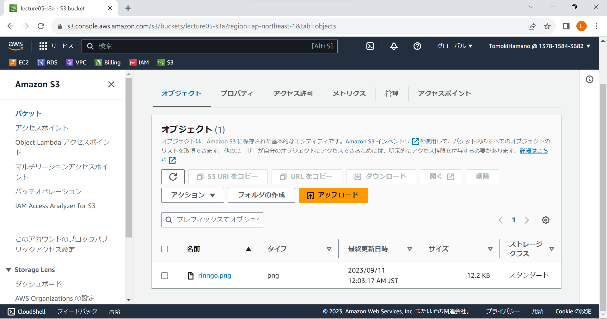
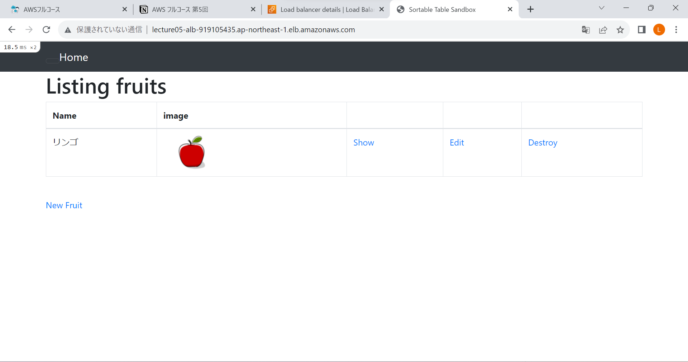

# 第５回課題報告書
- nginx+unicornでブラウザプレビュー

- ALB追加

- S3追加

- EC2→S3アクセスしてオブジェクト確認

- ALB+S3追加後ブラウザプレビュー

- 構成図

## 感想
- nginx+unicornでの起動時にnginxがunicorn.sockを読み取りにいけないエラーの解決にとても時間がかかってしまった。そもそもファイルの読み取り事態に権限が必要だということがわかっていなかった。読み取り権限付与により解決。
- 今回の課題でログを追いかけることを沢山して、トラブル時はログを辿りエラー解消に向けたアクションが取れることが必要だと感じた。
