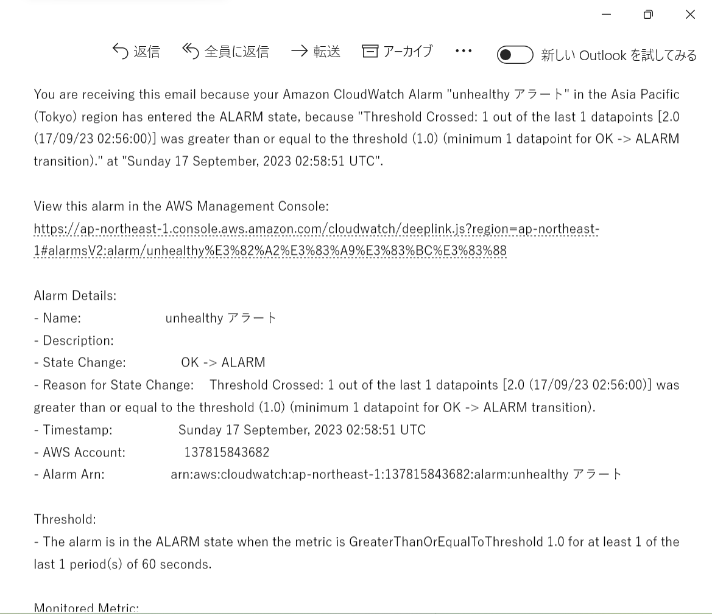
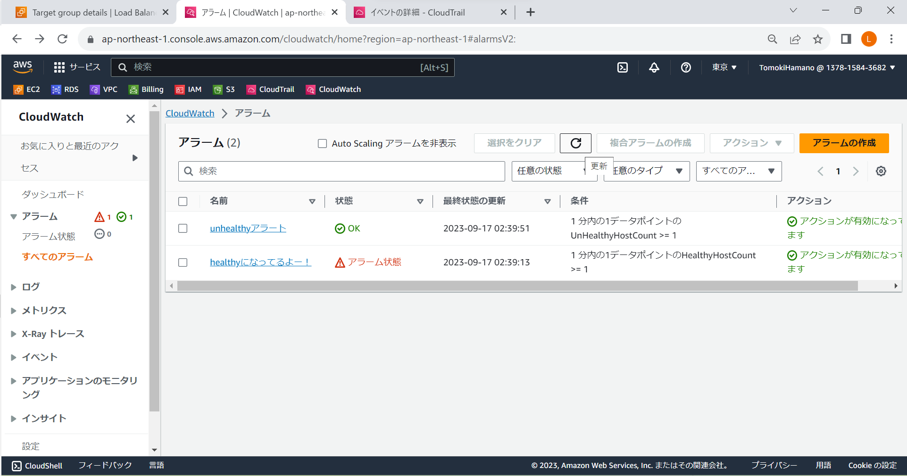
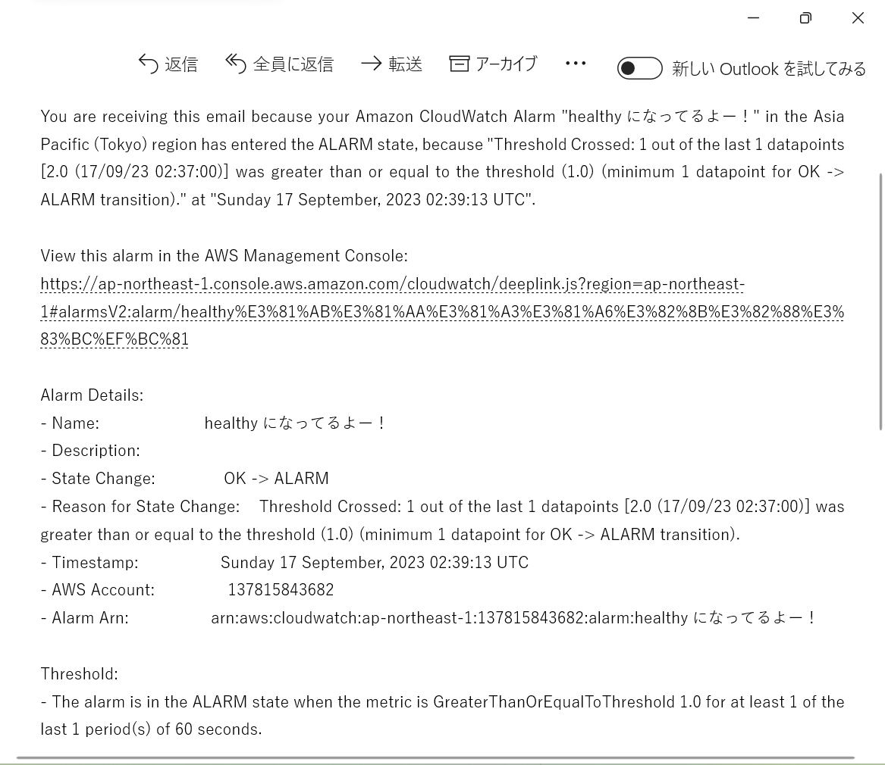
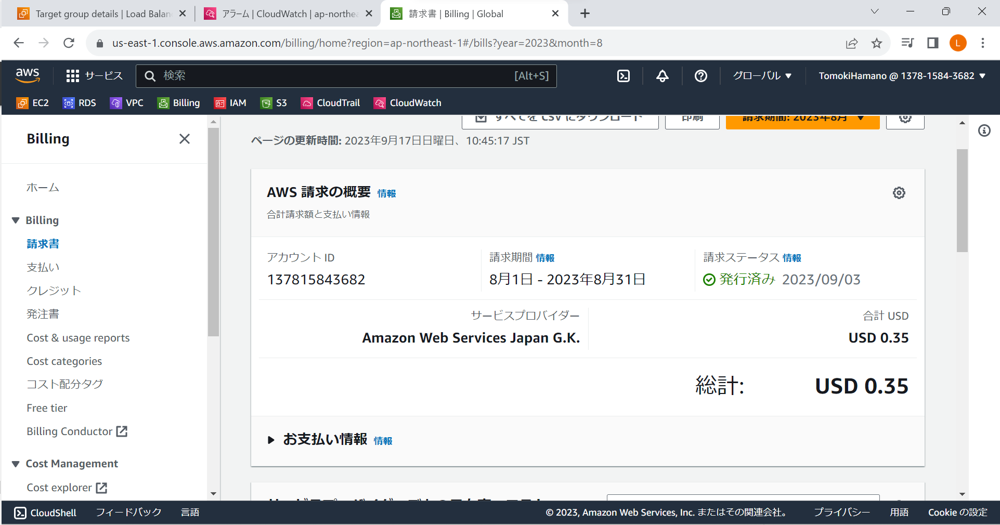

# 第６回課題

## CloudTrailイベント名+内容3つ
- イベント名 : PutMetricAlarm
- 内容１ evenTime : 2023-09-17T02:46:28Z
- 内容２ eventSource : monitoring.amazonaws.com
- 内容３ awsRegion : ap-northeast-1

### Cloudwatchアラーム
- Unhealthyアラーﾑ（Raislアプリケーション使用不可状態）

- healthy OK（Railsアプリケーション使用可能状態）

#### AWS利用料見積
[AWS利用料見積はこちら]<https://calculator.aws/#/estimate?id=7f4811fe40f39904d7940300047a77ba6050f4b6>

##### AWS８月度利用料

- ８月度利用額発生の要因としては、第４回課題と第５回課題取組時複数のリージョンでRDSのスナップショットを作成してしまっていたことが挙げられる。現在は削除済み。
