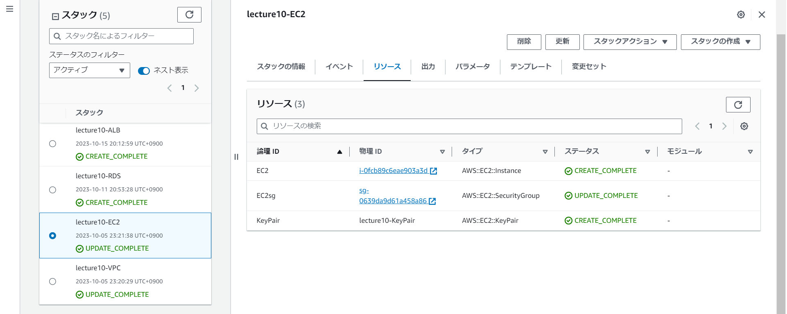
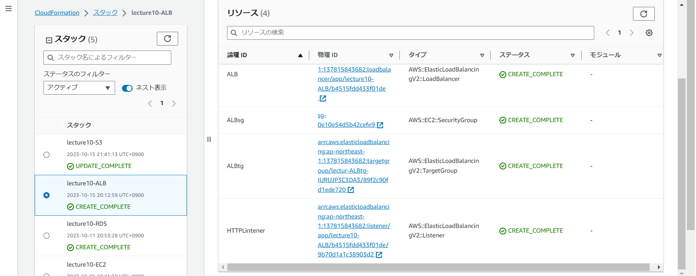
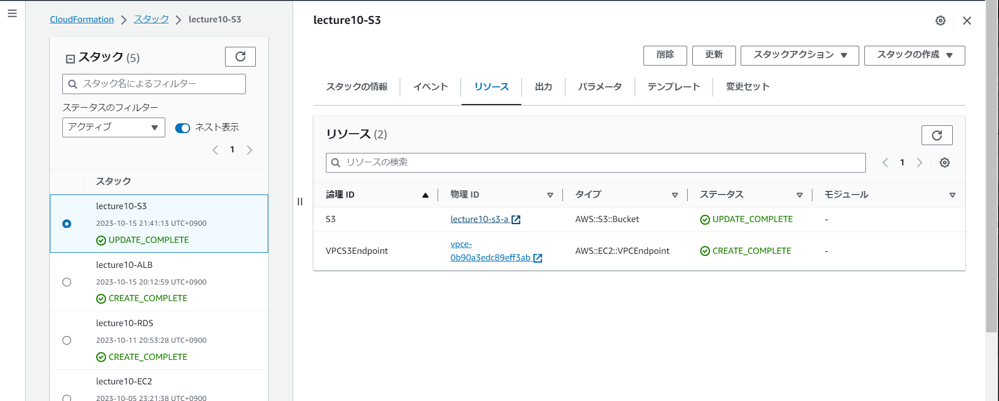

# 第10回課題

## 課題内容:構成図参考にしてCloudFormationを利用して環境をコード化
- 今回は第５回課題で作成した構成図を使用


### 各テンプレート+リソース写真
- VPC･InternetGateWay･Subnets･Routetable
```
AWSTemplateFormatVersion: 2010-09-09

Description: VPC-template

Resources:
#----------------------------------------------------------
# VPC
#----------------------------------------------------------
 VPC:
   Type: AWS::EC2::VPC
   Properties:
     CidrBlock: 10.5.0.0/16
     EnableDnsSupport: 'true'
     EnableDnsHostnames: 'true'
     Tags:
      - Key: Name
        Value: lecture10-vpc
#----------------------------------------------------------
# IGW
#----------------------------------------------------------
 InternetGateway:
   Type: AWS::EC2::InternetGateway
   Properties:
     Tags:
        - Key: Name
          Value: lecture10-IGW
 InternetGatewayAttachment:
   Type: AWS::EC2::VPCGatewayAttachment
   Properties:
     InternetGatewayId: !Ref InternetGateway
     VpcId: !Ref VPC
#----------------------------------------------------------
# Subnet-Public
#----------------------------------------------------------
 PublicSubnet1:
   Type: AWS::EC2::Subnet
   Properties:
     VpcId: !Ref VPC
     AvailabilityZone: ap-northeast-1a
     CidrBlock: 10.5.0.0/20
     MapPublicIpOnLaunch: true
     Tags: 
       - Key: Name
         Value: lecture10-subnet-public1-ap-northeast-1a

 PublicSubnet2:
   Type: AWS::EC2::Subnet
   Properties:
     VpcId: !Ref VPC
     AvailabilityZone: ap-northeast-1c
     CidrBlock: 10.5.16.0/20
     MapPublicIpOnLaunch: true
     Tags:
       - Key: Name
         Value: lecture10-subnet-public2-ap-northeast-1c
#----------------------------------------------------------
# Subnet-Private
#----------------------------------------------------------
 PrivateSubnet1:
   Type: AWS::EC2::Subnet
   Properties:
     VpcId: !Ref VPC
     AvailabilityZone: ap-northeast-1a
     CidrBlock: 10.5.128.0/20
     MapPublicIpOnLaunch: false
     Tags:
       - Key: Name
         Value: lecture10-subnet-private1-ap-northeast-1a

 PrivateSubnet2:
   Type: AWS::EC2::Subnet
   Properties:
     VpcId: !Ref VPC
     AvailabilityZone: ap-northeast-1c
     CidrBlock: 10.5.144.0/20
     MapPublicIpOnLaunch: false
     Tags:
       - Key: Name
         Value: lecture10-subnet-private2-ap-northeast-1c
#----------------------------------------------------------
# RouteTable-Public
#----------------------------------------------------------
 PublicRouteTable:
   Type: AWS::EC2::RouteTable
   Properties:
     VpcId: !Ref VPC
     Tags:
       - Key: Name
         Value: lecture10-Public-RouteTable
          
 DefaultPublicRoute:
    Type: AWS::EC2::Route
    DependsOn: InternetGatewayAttachment
    Properties:
      RouteTableId: !Ref PublicRouteTable
      DestinationCidrBlock: 0.0.0.0/0
      GatewayId: !Ref InternetGateway
      
 PublicSubnet1RouteTableAssociation:
   Type: AWS::EC2::SubnetRouteTableAssociation
   Properties:
     RouteTableId: !Ref PublicRouteTable
     SubnetId: !Ref PublicSubnet1

 PublicSubnet2RouteTableAssociation:
   Type: AWS::EC2::SubnetRouteTableAssociation
   Properties:
     RouteTableId: !Ref PublicRouteTable
     SubnetId: !Ref PublicSubnet2
#----------------------------------------------------------
# RouteTable-Private
#----------------------------------------------------------
 PrivateRouteTable1:
   Type: AWS::EC2::RouteTable
   Properties:
     VpcId: !Ref VPC
     Tags:
       - Key: Name
         Value: lecture10-Private-RouteTable-1

 PrivateSubnet1RouteTableAssociation:
   Type: AWS::EC2::SubnetRouteTableAssociation
   Properties:
     RouteTableId: !Ref PrivateRouteTable1
     SubnetId: !Ref PrivateSubnet1

 PrivateRouteTable2:
   Type: AWS::EC2::RouteTable
   Properties:
     VpcId: !Ref VPC
     Tags:
       - Key: Name
         Value: lecture10-Private-RouteTable-2

 PrivateSubnet2RouteTableAssociation:
   Type: AWS::EC2::SubnetRouteTableAssociation
   Properties:
     RouteTableId: !Ref PrivateRouteTable2
     SubnetId: !Ref PrivateSubnet2
```
.png)
.png)

- EC2
```
AWSTemplateFormatVersion: 2010-09-09

Description: ec2-template

Resources:
#----------------------------------------------------------
# EC2 keypair
#----------------------------------------------------------            
 KeyPair:
   Type: AWS::EC2::KeyPair
   Properties:
     KeyName: lecture10-KeyPair
#----------------------------------------------------------
# EC2
#---------------------------------------------------------- 
 EC2:
   Type: AWS::EC2::Instance
   Properties:
     ImageId: ami-07d6bd9a28134d3b3
     InstanceType: t2.micro
     AvailabilityZone: ap-northeast-1a
     SubnetId: !ImportValue PublicSubnet1
     KeyName: !Ref KeyPair
     SecurityGroupIds:
       - !Ref EC2sg
     Tags:
       - Key: Name
         Value: lecture10-EC2
#----------------------------------------------------------
# EC2 Security-Group
#----------------------------------------------------------  
 EC2sg:
   Type: AWS::EC2::SecurityGroup
   Properties: 
     GroupDescription: lecture10-EC2sg
     VpcId: !ImportValue VPC
     SecurityGroupIngress: 
       - IpProtocol: tcp
         FromPort: 80
         ToPort: 80
         CidrIp: 0.0.0.0/0
         Description: HTTP From AnyWhere         
      
       - IpProtocol: tcp
         FromPort: 22
         ToPort: 22
         CidrIp: 0.0.0.0/0
         Description: SSH From AnyWhere
     Tags: 
       - Key: Name
         Value: lecture10-EC2sg
```


- RDS
```
AWSTemplateFormatVersion: 2010-09-09

Description: RDS-template

Resources:
#----------------------------------------------------------
# RDS
#----------------------------------------------------------
 RDS:
   Type: AWS::RDS::DBInstance
   Properties:
     AvailabilityZone: ap-northeast-1a
     DBInstanceIdentifier: lecture10-database
     DBSubnetGroupName: !Ref RDSSubnetGroup
     DBInstanceClass: db.t3.micro
     AllocatedStorage: 20
     Engine: mysql
     MasterUsername: admin
     MasterUserPassword: lecture10
     CopyTagsToSnapshot: false
     DeleteAutomatedBackups: true
     PubliclyAccessible: false
     MultiAZ: false
     VPCSecurityGroups: 
       - !Ref RDSsg
     Tags:
       - Key: Name
         Value: lecture10-database
#----------------------------------------------------------
# RDS Security-Group
#----------------------------------------------------------  
 RDSsg:
   Type: AWS::EC2::SecurityGroup
   Properties:
     GroupName: lecture10-RDS-Security-Group
     GroupDescription: RDS-Security-Group
     VpcId: !ImportValue VPC
     SecurityGroupIngress:
       - IpProtocol: tcp
         FromPort: 3306
         ToPort: 3306
         SourceSecurityGroupId: !ImportValue EC2sg
     Tags:
       - Key: Name
         Value: lecture10rds-sg
#---------------------- ------------------------------------
# RDS Subnet-Group
#----------------------------------------------------------  
 RDSSubnetGroup: 
   Type: AWS::RDS::DBSubnetGroup
   Properties: 
     DBSubnetGroupName: RDS-SubnetGroup
     DBSubnetGroupDescription: lecture10-RDS-Subnet-Group
     SubnetIds:
       - !ImportValue PrivateSubnet1
       - !ImportValue PrivateSubnet2
```


- ALB
```
AWSTemplateFormatVersion: 2010-09-09

Description: ALB-template

Resources:
#----------------------------------------------------------
# ALB
#----------------------------------------------------------
 ALB:
   Type: AWS::ElasticLoadBalancingV2::LoadBalancer
   Properties: 
     IpAddressType: ipv4
     Name: lecture10-ALB
     Scheme: internet-facing
     SecurityGroups: 
       - !Ref ALBsg
     SubnetMappings: 
        - SubnetId: !ImportValue PublicSubnet1
        - SubnetId: !ImportValue PublicSubnet2
     Type: application
     Tags: 
       - Key: Name
         Value: lecutre10-ALB
#----------------------------------------------------------
# ALB Security-Group
#----------------------------------------------------------  
 ALBsg:
   Type: AWS::EC2::SecurityGroup
   Properties: 
     GroupDescription: lecture10-ALBsg
     VpcId: !ImportValue VPC
     SecurityGroupIngress: 
       - IpProtocol: tcp
         FromPort: 80
         ToPort: 80
         CidrIp: 0.0.0.0/0
         Description: HTTP From AnyWhere         
     Tags: 
       - Key: Name
         Value: lecture10-ALBsg
#----------------------------------------------------------
# ALB Target-Group
#----------------------------------------------------------  
 ALBtg:
   Type: AWS::ElasticLoadBalancingV2::TargetGroup
   Properties: 
     HealthCheckIntervalSeconds: 30
     HealthCheckEnabled: true
     HealthCheckPath: /
     HealthCheckPort: traffic-port
     HealthCheckProtocol: HTTP
     HealthCheckTimeoutSeconds: 5
     HealthyThresholdCount: 5
     IpAddressType: ipv4
     Port: 80
     Protocol: HTTP
     ProtocolVersion: HTTP1
     TargetType: instance
     Targets: 
         - Id: !ImportValue EC2
           Port: 80
     UnhealthyThresholdCount: 2
     VpcId: !ImportValue VPC
     Matcher: 
        HttpCode: 200
     Tags: 
       - Key: Name
         Value: lecture10-ALB-tg    
#----------------------------------------------------------
# HTTP Lintener
#----------------------------------------------------------  
 HTTPLintener:
   Type: AWS::ElasticLoadBalancingV2::Listener
   Properties:
     DefaultActions: 
       - Type: forward
         TargetGroupArn: !Ref ALBtg
     LoadBalancerArn: !Ref ALB
     Port: 80
     Protocol: HTTP
```


- S3･VPCEndpoint
```
AWSTemplateFormatVersion: 2010-09-09

Description: S3-template

Resources:
#----------------------------------------------------------
# S3
#----------------------------------------------------------
 S3:
   Type: AWS::S3::Bucket
   Properties:
     BucketName: lecture10-s3-a
     AccessControl: Private
     PublicAccessBlockConfiguration:
       BlockPublicAcls: True
       BlockPublicPolicy: True
       IgnorePublicAcls: True
       RestrictPublicBuckets: True
#----------------------------------------------------------
# VPC-Endpoint
#---------------------------------------------------------- 
 VPCS3Endpoint:
   Type: "AWS::EC2::VPCEndpoint"
   Properties:
     RouteTableIds:
       - !ImportValue PublicRouteTable
     ServiceName: com.amazonaws.ap-northeast-1.s3
     VpcEndpointType: Gateway
     VpcId: !ImportValue VPC
```
