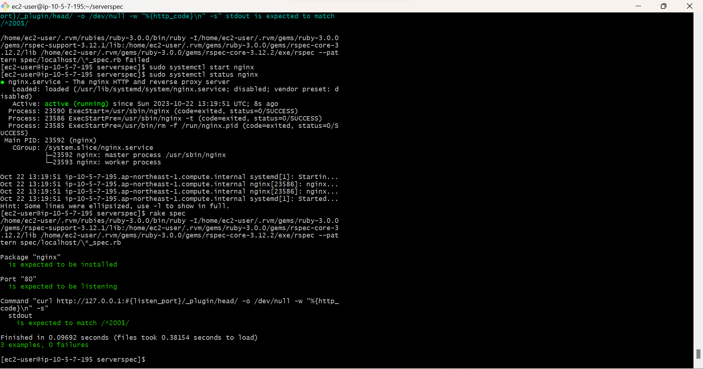

# 第11回課題

## 課題内容:ServerSpecを用いてのテスト実施

### テスト内容
- Nginxのインストールが完了しているか
- 指定のポートがリッスン（通信待ち受け状態）であること
- テスト接続して動作すること

#### 準備
- rvmを使用してのRubyインストール
```
$ sudo yum update -y
$ gpg2 --keyserver keyserver.ubuntu.com --recv-keys 409B6B1796C275462A1703113804BB82D39DC0E3 7D2BAF1CF37B13E2069D6956105BD0E739499BDB
$ \curl -sSL https://get.rvm.io | bash -s stable
$ \curl -sSL https://get.rvm.io | bash -s stable --rails
$ echo 'source /home/ec2-user/.rvm/scripts/rvm' >> ${HOME}/.bashrc
$ source /home/ec2-user/.rvm/scripts/rvm
```
- Nginxのインストールと起動+運転状態確認
```
$ sudo amazon-linux-extras install nginx1 -y
$ sudo systemctl start nginx
$ sudo systemctl status nginx
```
- Serverspecインストールと実装
```
$ gem install serverspec
```
```
$ serverspec-init

Select OS type:

  1) UN*X
  2) Windows

Select number: 1

Select a backend type:

  1) SSH
  2) Exec (local)

Select number: 2

 + spec/localhost/
 + spec/localhost/sample_spec.rb
```

##### テストコード
- 生成されたsample_spec.rbを事前配布されていたサンプルのものに置換する。
ただし、Nginxを80番ポートでリッスンさせるため、ポート番号を80に変更。
- テストコードは下記のものを使用。
```
require 'spec_helper'

listen_port = 80       

describe package('nginx') do
  it { should be_installed }
end

describe port(listen_port) do
  it { should be_listening }
end

describe command('curl http://127.0.0.1:#{listen_port}/_plugin/head/ -o /dev/null -w "%{http_code}\n" -s') do
  its(:stdout) { should match /^200$/ }
end
```
###### テスト実施
```
$ rake spec
```
- Nginxが入っており80番ポートがListen状態である事、curlの結果200でOKが返ってきている事、0 failuresになっている事を確認。

